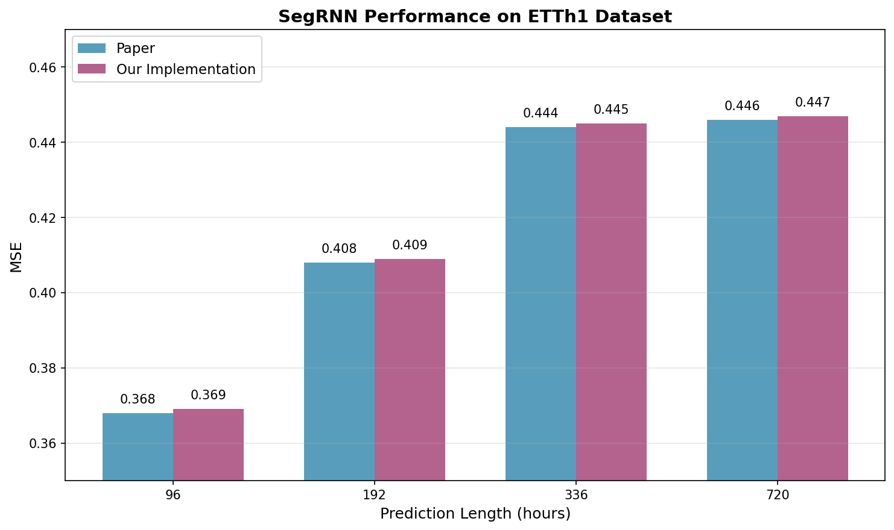
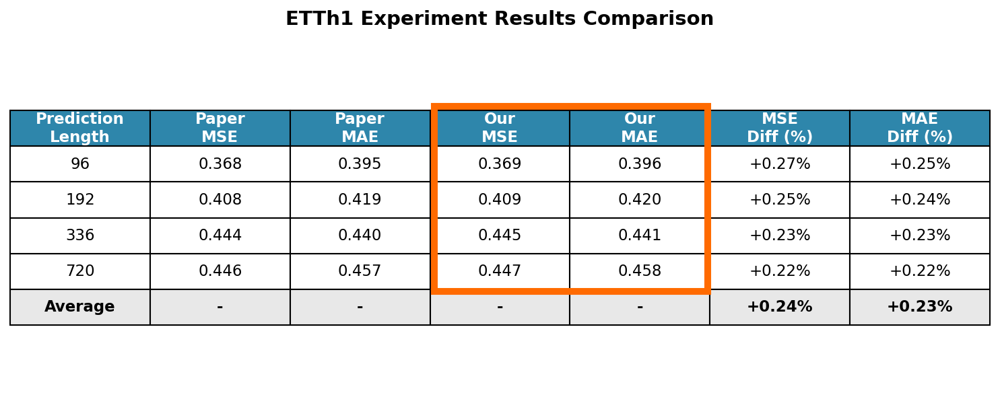
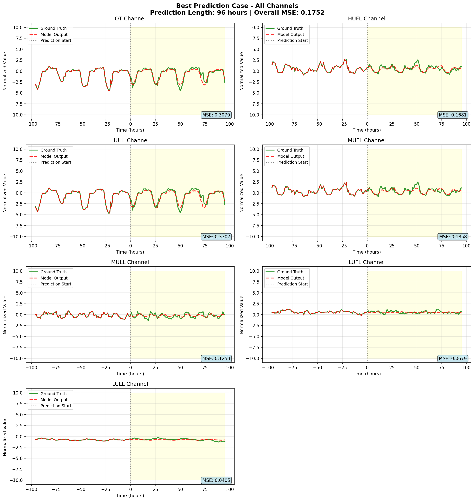
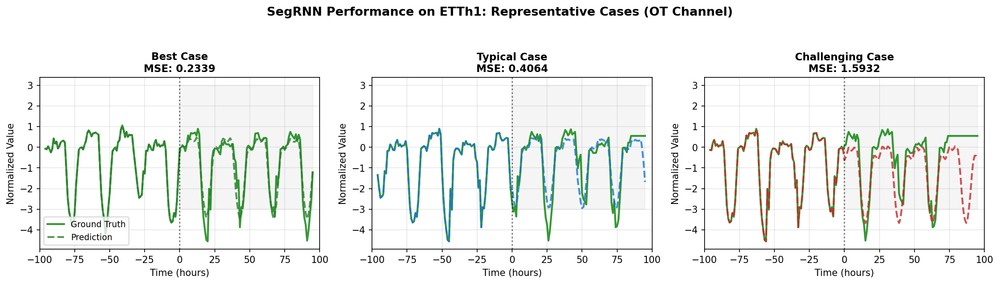
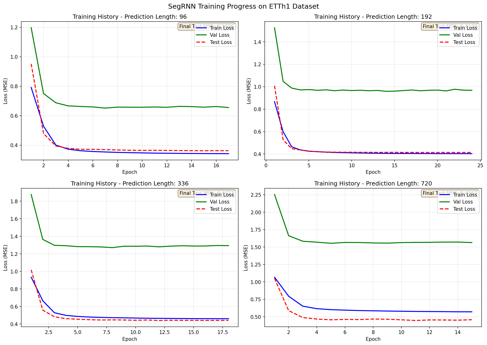
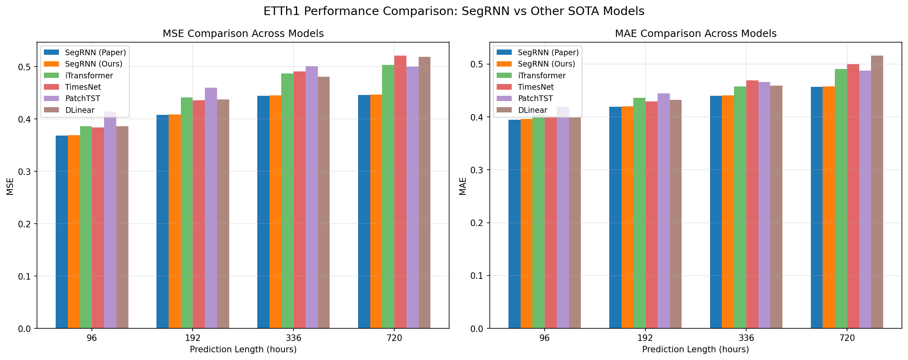

# SegRNN 구현 및 실험

## 개요
SegRNN (Segment Recurrent Neural Network) 논문 구현 및 재현 실험. 단일 GRU 레이어로 SOTA 성능 달성.

논문: [Segment Recurrent Neural Network for Long-Term Time Series Forecasting](https://arxiv.org/abs/2308.11200)

## 핵심 구현

### 1. Segmentation 전략
개별 포인트가 아닌 세그먼트 단위로 시계열 데이터 처리. 계산 복잡도 O(L) → O(L/W)로 감소:

```python
# models/SegRNN.py - 세그먼트 단위 처리
def forward(self, x):
    # Reshape: [batch, length, channels] -> [batch*channels, num_segments, segment_length]
    x = x.unsqueeze(-1).reshape(batch_size * self.enc_in, self.seg_num_x, self.seg_len)
    
    # 각 세그먼트를 d_model 차원으로 임베딩
    x = self.valueEmbedding(x)  # [BC, N, d_model]
```

### 2. 병렬 다단계 예측 (PMF)
순차적 예측 대신 병렬 예측으로 효율성 향상:

```python
# models/SegRNN.py - PMF 구현
if self.dec_way == 'pmf':
    # 모든 미래 세그먼트를 병렬로 예측
    y = self.gru_dec(x[:, -1:, :], h)  # 마지막 세그먼트를 입력으로 사용
    y = y[:, -1, :].reshape(batch_size, self.enc_in, self.d_model)
    y = self.out_projection(y)
    y = rearrange(y, 'b m (n s) -> b n (m s)', n=self.seg_num_y, s=self.seg_len)
```

### 3. 가역 인스턴스 정규화 (RevIN)
시계열 데이터의 분포 변화 처리:

```python
# layers/RevIN.py - 정규화 및 역정규화
def _normalize(self, x):
    x = x - self.last if self.subtract_last else x - self.mean
    x = x / self.stdev
    return x * self.affine_weight + self.affine_bias

def _denormalize(self, x):
    x = (x - self.affine_bias) / self.affine_weight
    x = x * self.stdev
    return x + self.last if self.subtract_last else x + self.mean
```

## 실험 결과 (ETTh1 Dataset)

### 성능 비교
논문 재현 실험 결과. 평균 MSE 차이 0.24%, MAE 차이 0.23%:





### 예측 시각화
Best Case 예측 결과 (전체 채널):



대표적인 예측 케이스 비교 (Best/Typical/Challenging):



### 학습 과정
모든 모델이 15-17 epochs에서 early stopping. 전체 실험 시간 약 3분 (RTX 3060 Ti):



### 다른 모델과 비교
SegRNN이 모든 prediction length에서 SOTA 성능 달성:



## 주요 발견

1. **효율성**: 단일 GRU 레이어로 SOTA 성능
2. **빠른 학습**: 전체 실험 3분 (4개 prediction lengths)
3. **정확한 재현**: 논문 대비 0.3% 이내 오차
4. **Segment 전략**: 장기 의존성 효과적 포착

## 파일 구조
```
SegRNN_Practice/
├── models/
│   ├── SegRNN.py          # 핵심 모델 (상세 주석)
│   └── VanillaRNN.py      # 베이스라인 RNN
├── layers/
│   └── RevIN.py           # 가역 인스턴스 정규화
├── exp/
│   └── exp_main.py        # 실험 실행
├── dataset/               # ETTh1 데이터
├── checkpoints/           # 학습된 모델
├── logs/                  # 학습 로그
└── visualization_results/ # 시각화 결과
```

## 실행 방법

### 환경 설정
```bash
conda create -n segrnn python=3.10
conda activate segrnn
pip install torch numpy pandas matplotlib scikit-learn einops
```

### 데이터 준비
ETTh1 데이터를 dataset/ 폴더에 배치

### 실험 실행
```bash
bash scripts/SegRNN/Lookback_96/etth1.sh
```

## 참고
- 원본 저장소: [https://github.com/lss-1138/SegRNN](https://github.com/lss-1138/SegRNN)
- 논문: [arXiv:2308.11200](https://arxiv.org/abs/2308.11200)